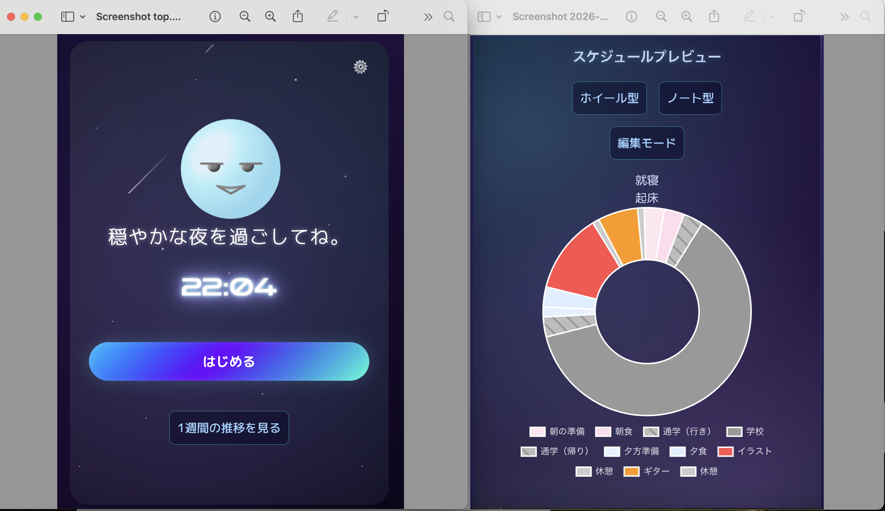

# TimeWheel
> **スケジュール生成・管理アプリ**


## Engineering Concepts

### Technical Highlights: アルゴリズムの解説
本プロジェクトでは、24時間を超える計算の複雑性と、リアルタイムな整合性を担保するために、以下の3つの主要ロジックを自作しました。

1. 時間の正規化：通算分（Absolute Minutes）への変換
時計の時刻（00:00〜23:59）をそのまま計算に使うと、日をまたぐ際の大小比較（例：23:00と01:00）で不整合が生じます。 これを解消するため、**「起床時間を0分としたタイムライン」**への正規化を行いました。

```JavaScript

/*
    起床時間を起点とした通算分を算出
    24時を跨ぐ場合（起床時間より数値が小さい場合）は+1440分して正規化
*/

 function absoluteMinutes(val) {
  let m = (typeof val === "number") ? val : toMinutes(val);
  const wake = toMinutes(wakeTime.value);
  
  // 起床時間より前（＝翌日）の時刻は、24時間分を加算してタイムラインを直線化
  return m < wake ? m + 1440 : m;
}
```

効果: 日またぎの計算を単純な数値比較（A < B）に落とし込み、バグを排除。24時間営業や深夜まで活動するユーザーにも完全対応しました。

2. スケジュールの数珠つなぎ：連鎖的同期ロジック
一箇所の予定を変更すると、後続のすべての予定がドミノ倒しのように自動調整される「数珠つなぎ」の仕組みを実装しました。

```JavaScript

/*
   変更された活動より後ろのスケジュールをすべてずらす
 */

function adjustLaterActivities(startIndex) {
  for (let i = startIndex + 1; i < schedule.value.length; i++) {
    const prev = schedule.value[i-1];
    const current = schedule.value[i];
    const prevEndMin = toMinutes(prev.end);
    const duration = toMinutes(current.end) - toMinutes(current.start);
    
    // 前の予定の終了時刻を、次の予定の開始時刻に代入
    schedule.value[i].start = toTimeString(prevEndMin);
    schedule.value[i].end = toTimeString(prevEndMin + duration);
  }
  schedule.value = [...schedule.value]; // リアクティブ更新のトリガー
}
```

効果: ユーザーは一つの時間を変更するだけで、一日のタイムスケジュール全体が再構築されます。これにより「管理するための操作」を最小化しました。

3. 高レスポンスなリアクティブ・システム
Pinia を中心としたデータフローを構築し、複雑な計算をバックグラウンドで完結させています。

同期の自動化: スケジュールの変更が、グラフ・リスト・アバターの反応へと即座に、かつ矛盾なく伝播する「単一の信頼できる情報源（SSoT）」を実現しました。

4. 非同期アニメーションとチュートリアルの同期
オープニングアニメーションとチュートリアルの開始タイミングが重なり、ターゲットとなるDOMが未描画でエラーになる課題がありました。 そこで、requestAnimationFrame を用いた DOM監視ポーリングロジック を自作し、確実にレンダリングが完了してからステップを開始させる堅牢なフローを構築しました。

### 「時間の正規化」ロジック（絶対時間への変換）
```JavaScript

/**
 * 起床時間を起点とした「通算分」への正規化
 * 24時を跨ぐ場合（起床時間より数値が小さい場合）は+1440分して直線化する
 */
function absoluteMinutes(val) {
  let m = (typeof val === "number") ? val : toMinutes(val);
  const wake = toMinutes(wakeTime.value);
  
  // 起床時間より前（＝翌日）の時刻は、24時間分を加算してタイムラインを直線化
  return m < wake ? m + 1440 : m;
}

```

### 「数珠つなぎ」ロジック（連鎖的同期）


```JavaScript

/**
 * 変更された活動より後ろのスケジュールをすべてずらす「数珠つなぎ」アルゴリズム
 */
function adjustLaterActivities(startIndex) {
  for (let i = startIndex + 1; i < schedule.value.length; i++) {
    const prev = schedule.value[i-1];
    const current = schedule.value[i];
    const prevEndMin = toMinutes(prev.end);
    const duration = toMinutes(current.end) - toMinutes(current.start);
    
    // 前の予定の終了時刻を、次の予定の開始時刻に代入
    schedule.value[i].start = toTimeString(prevEndMin);
    schedule.value[i].end = toTimeString(prevEndMin + duration);
  }
  schedule.value = [...schedule.value]; // Proxy経由でVueに反映を通知
}

```
###　「DOM待機付きチュートリアル」ロジック

```JavaScript
/**
 * 非同期描画されるDOM要素を安全に取得するためのポーリング処理
 */
async function waitForElement(selector, timeout = 3000) {
  const start = Date.now();
  return new Promise((resolve) => {
    const check = () => {
      const el = document.querySelector(selector);
      if (el) return resolve(true); // 要素を発見
      if (Date.now() - start > timeout) return resolve(false); // タイムアウト
      requestAnimationFrame(check); // 次のフレームで再チェック
    };
    check();
  });
}

```


## Tech Stack & Architecture

### Core Technologies
Frontend: Vue 3 (Composition API)

State Management: Pinia (Single Source of Truth)

全て計算ロジックをストアに集約。入力された時間をリアルタイムに再計算し、アプリ全体の整合性を担保。

Visualizer: Chart.js / patternomaly

計算結果を即座に視覚化。色だけでなく「模様」を用いることで、色覚多様性への配慮と直感的な把握を両立。

Interactive UI: vuedraggable

ドラッグ＆ドロップによる直感的なタスク順序の入れ替えを実現。

PWA Support: Vite PWA

オフライン動作と軽量なアプリ化を実現し、アクセシビリティを向上。

Infrastructure: Vite / Vercel


## Design Philosophy: ユニバーサルデザインへの配慮
単なるスケジューラーに留まらず、あらゆるユーザーにとっての「使いやすさ」を技術で実装しています。

高コントラスト・テーマ: ギャラクシー（宇宙）をテーマにした配色により、視認性を向上。

多層的な情報提供: グラフに patternomaly を採用。色だけでなく「模様」で項目を判別可能にし、低コントラスト環境や色覚多様性に対応。

エフェメラル設計:過去の未達成タスクが心理的なプレッシャー（ノイズ）にならないよう、データ保持期間を直近1週間に限定。過去に縛られるのではなく、常に「今」の自分に最適な計画を立てるための「心地よいリセット」を仕組みとして取り入れ、継続的なセルフケアを支援する設計思想を採用しています。